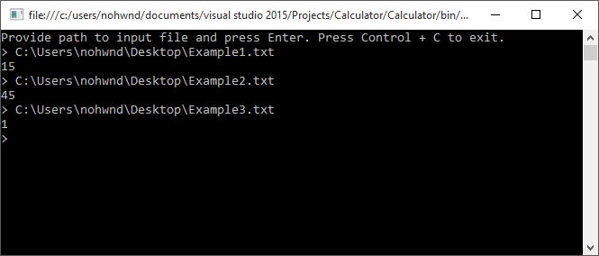

# Calculator

This is a slightly over-engineered solution to our Calculator problem. :) 

The whole solution was developed using strict TDD approach, but even though some of the cases slipped through my net and I ended up doing few characterization tests. Mainly for protecting the inputs. In the end the code nears 100% test-coverage.

The whole solution was also developed with DI in mind, althought there are very few places where DI is beneficial in this problem. There is one example though, the `FileWrapper`, which wraps the `System.IO.File`, and implements `IFile` to make testing simple. 

I am not very happy with the `IFile` interface though, it's leaky, but I did not want to over-complicate the solution even more, by providing na `IDataSource` interface or somthing.

The tests are using multiple variations of auto-mocking and auto-fixturing to avoid newing-up instances of SUT. This keeps our hands free when constructor signatures change, a natural side-effect of constructor injection.

The solution is executed through command line interface. You can find the given examples pre-canned in the `Examples` folder of the solution. 

